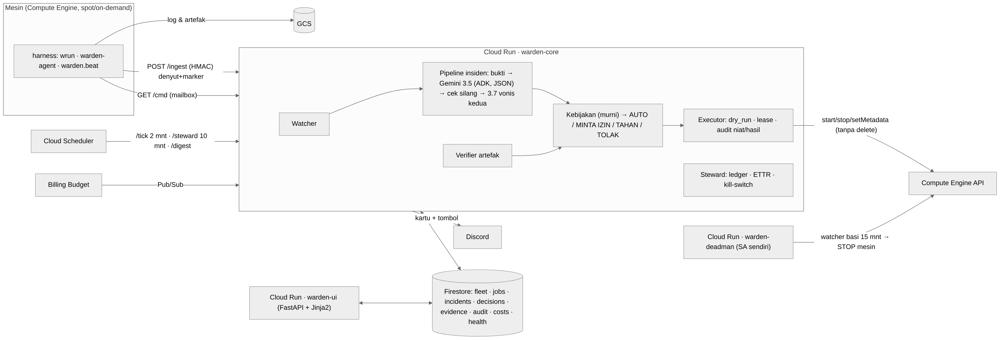
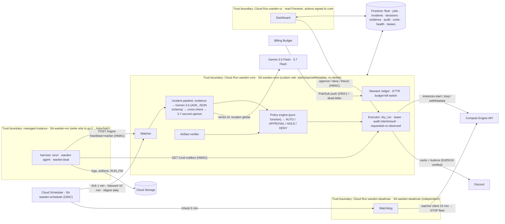

# Warden

**Warden is an SRE agent for long-running compute jobs — training, evaluation, pipelines — on rented cloud machines.**
Two sentences carry the whole design:

- **A live machine ≠ correct training.** `RUNNING` means nothing. What matters: steps advance, loss is finite, disk suffices, exactly one process runs — and if it stops, someone knows within minutes.
- **Finished ≠ intact.** A `DONE` marker, exit code 0, a file that "exists" at the right size — every one of these has lied to us. Only an artifact that has been *opened* is trusted.

Warden replaces four generations of hand-written "babysitter" scripts and encodes 28 failures we actually paid for (`docs/FAILURE-CATALOG.md`). It runs on Google Cloud and uses Gemini through the Agent Development Kit — but the LLM never holds the button.

Bahasa Indonesia: `docs/README.id.md`.

## What it does

| Capability | How |
|---|---|
| Job lifecycle from a spec | `POST /jobs/launch` / dashboard form / `warden launch spec.yaml`: ledger first, zone chosen around stock-outs and quota, spot VM with STOP-on-preempt and a never-auto-deleted disk, harness installed from metadata; first heartbeat = alive; artifacts verified → final report (spend, ETTR, incidents resolved by Warden vs. by a human) → machine stopped. |
| Deterministic detection | The Watcher runs every minute: instance status, harness heartbeats, signed markers, artifacts. Two-signal rules (a silent signal *and* an activity signal) for stuck / idle / orphan, so a busy machine is never mistaken for a dead one. |
| Patrol, not only reaction | Trend rules on the last 30 heartbeats: throughput drop vs. a learned baseline while the machine is busy, gradient spikes, loss plateau, disk-fill projection (acts before the disk is full), VRAM creep. Baselines (step rate, heartbeat interval, checkpoint size) are learned from verified data. |
| Semantic diagnosis | Gemini 3.5 Flash via ADK (`LlmAgent` with a fixed `output_schema`) reads logs only when regexes cannot decide safely. Every claim must cite log line numbers; a **deterministic cross-check** verifies the citations and the numbers; Gemini 3.7 Flash gives a second opinion when confidence is low. |
| Artifact verification | `torch.load`, CSV/JSONL/NPZ/Parquet parsers, sidecar checksums, size vs. expectation, "measure only when the writer is quiet". `VERIFIED` is written by Warden alone. |
| Every recommendation has an executor | start / stop / resume (same, smaller batch, fewer workers, clean) / kill / quarantine / rollback to last good checkpoint with lower lr / clean_disk (local checkpoints already in Storage, hash-verified) / relocate_zone (snapshot → new zone) / change_machine_type / resize_disk. Machine-side actions travel as **signed** mailbox commands; the harness reports what happened. |
| World-verified recovery loop | After every action the incident is *Verifying*: a new boot, the step advancing, the new run's exit code, disk free space, the harness result. Only the world resolves an incident. If it does not hold, Warden moves to the next hypothesis on a per-category ladder (OOM: batch 0.5 → 0.25 → bigger machine; NaN: rollback + lr 0.5 → two back + lr 0.25 → stop; disk: clean → resize; preempt: start → relocate) and asks a human only when the ladder is exhausted. |
| Memory that changes decisions | Postmortems (vector-indexed) of the same pattern put the action that worked before at the front of the ladder — this job first, other jobs second — and are cited on the decision. Two human dismissals of the same alarm in 7 days make Warden withhold that action. |
| Graduated trust | 5 consecutive human approvals without a failure promote an action to automatic for that job; a failed verification demotes it. Every limit that changes a decision is a visible event. Manual mode (`hold`) and per-job policy overrides. |
| Policy-governed action | Graduated autonomy per action type (L0 observe → L1 propose → L2 act then report → L3 act silently), rate and cost limits, circuit breaker, `dry_run` for every action, explicit blast radius, per-job lease. **Delete does not exist as an action.** |
| Budget stewardship | Real-time ledger, ETTR (effective training time ÷ paid machine time), orphan/idle → STOP, Billing Budget kill-switch at 50 / 80 / 100 %. |
| External watchdog | `warden-deadman` — a separate service with its own identity. If Warden stops heartbeating for 15 minutes, it stops the fleet. |
| Humans on a phone | Discord cards with evidence, cost and Approve / Deny / Always buttons; `/warden freeze` as the global red button; screenshots from a phone are read by Gemini. |
| Dashboard | FastAPI + Jinja2 over a single design-system stylesheet: inbox-first Overview, incident pages as a narrative plus a decision rail (Detected → Diagnosed → Approval → Execute → Verify), jobs, fleet, budget, policies, audit log, system health. |

## Architecture

Three services, three identities. Actions never depend on the UI, and the watchdog never shares fate with what it watches.



<details><summary>Same diagram as Mermaid (renders on GitHub)</summary>


</details>

**Google Cloud services:** Cloud Run (3 services), Firestore, Pub/Sub (with dead-letter), Cloud Scheduler, Secret Manager, Compute Engine, Cloud Storage, Cloud Logging/Monitoring (log-based metrics, SLOs, alerts), Billing Budgets, Vertex AI. **Models:** `gemini-3.5-flash` (diagnosis, multimodal), `gemini-3.5-flash-lite` (prefilter), `gemini-3.7-flash` (second opinion), all through Vertex AI with service-account identity — no API keys in production. **Agent framework:** Google ADK (`LlmAgent`, `InMemoryRunner`, schema-constrained output).

### Control loop
1. **Ingest** — the harness posts heartbeats (30 s) and signed markers; the ingest layer stores and never thinks.
2. **Watcher** (every minute) — provider status + heartbeats + markers + artifacts → deterministic rules → incidents with dedupe keys; writes its own heartbeat.
3. **Incident pipeline** — the only place an LLM runs: evidence → `Diagnosis` JSON → deterministic cross-check (cited lines must exist, an OOM claim must match an OOM regex or VRAM ≥ 95 %) → policy verdict.
4. **Executor** — per-job lease, audit *intent*, act through the provider, wait for the operation, compare requested vs. observed, audit *result*. A mismatch opens a new incident.
5. **Recovery** (every minute) — every `VERIFYING` incident is checked against the world; a failed check moves to the next hypothesis (policy-evaluated, audited) or escalates with the reason.
6. **Steward** (every 10 minutes) — cost ledger, idle/orphan two-signal detection, runway projection, learned baselines, autonomy promotion/demotion, postmortems, daily digest.

Architecture decision records: `docs/adr/`. Failure catalog: `docs/FAILURE-CATALOG.md`. Observability: `docs/OBSERVABILITY.md`. Security review: `docs/SECURITY-REVIEW.md`. Phase plan and gates: `plan.md`, `docs/STATUS-FASE.md`.

## Harness contract (the machine side)
Bash + Python standard library only, installed by one script, adopted by replacing a single launch line:

- `wrun <job> -- <original command>` — `flock`, `pipefail`, tee'd log; writes `RUN_START` and, on exit, `RUN_FIN.json` with the **child's exit code**, run id, boot id, artifacts with sha256, evidence numbers and an HMAC signature. Unsigned or exit-less markers are rejected.
- `warden-agent` (systemd) — heartbeats every 30 s (cpu, gpu, disk, entrypoint processes, log mtime, open writers, ssh sessions, preempt notice), uploads logs and artifacts (one background rsync), polls the command mailbox — no ssh anywhere in the critical path.
- `warden.beat()` — one call in the training loop: phase, step, loss, lr, grad_norm, checkpoint. Legacy jobs run in log-parser mode; their findings carry a confidence penalty, so destructive actions always ask a human.
- Preempt notice → `SIGUSR1` → emergency checkpoint; `startup.sh` resumes from the last **intact** checkpoint at the last phase.

Full specification: `harness/MARKER-SPEC.md`.

## Quick start (≈30 minutes on a clean machine)
Prerequisites: `gcloud` on an account with billing, Python 3.12+, Java 21 (local emulators).

```bash
git clone <repo> warden && cd warden
python3.12 -m venv .venv && .venv/bin/pip install -r requirements-dev.txt
make emulators && make test        # 76 unit / end-to-end tests on the emulator
make smoke                         # real components: emulator + fake fleet + real Gemini on a real crash log
python -m chaos.run                # 25 deterministic failure scenarios (25/25)
```

Google Cloud (commands in `infra/`; every step is recorded in `docs/JURNAL-KEPUTUSAN.md`):
1. New project + billing + APIs (`run cloudbuild artifactregistry firestore pubsub secretmanager compute cloudscheduler aiplatform logging monitoring billingbudgets storage`).
2. Firestore Native; topics `warden-events`, `billing-alerts`, `warden-dead-letter`; bucket `<project>-warden`; Budget $150 with thresholds 25/50/80/100 % → Pub/Sub.
3. Service accounts `warden-core`, `warden-vm`, `warden-scheduler`, `warden-deadman` + custom role `wardenInstanceOperator` (**no** `compute.instances.delete`).
4. Secret Manager: `warden-ingest-hmac`, `warden-ui-secret`, optional `discord-*`.
5. Deploy: `gcloud run deploy warden-core --source .` (Procfile), `warden-ui` (Procfile.ui), `warden-deadman` (Procfile.deadman, own SA, no public access).
6. Scheduler: `/tick` every minute, `/steward` every 10 minutes, `/digest` daily, deadman `/check` every 5 minutes (all OIDC).

Watch a machine:
```bash
python -m warden.cli job add climate-demo --instance us-central1-a/demo-train-1 --command run_pipeline.py --legacy \
  --expect-json '{"pred.csv": {"columns": ["ID","TargetF1","TargetRAUC"], "rows": 1030, "range01_columns": ["TargetRAUC"]}}'
WARDEN_CORE_URL=... WARDEN_HMAC=... WARDEN_RESUME_CMD='bash /opt/job_bootstrap.sh' bash infra/vm_create.sh demo-train-1 climate-demo e2-standard-2
```
An **existing** machine: `sudo WARDEN_JOB=<id> WARDEN_CORE_URL=... WARDEN_HMAC=... bash harness/install.sh`, then change the launch line to `wrun --job <id> -- <original command>`.

## Evidence
- `make test` — 74 tests: policy matrix, state machine, Watcher rules (incl. trend patrol), end-to-end tick, recovery ladders and world-verification, lifecycle (launch, close-out, budget, preflight, two jobs at once), promotion/demotion, false-positive memory, approvals, verifier, Discord, infrastructure chaos (Gemini down, Discord down, slow Firestore).
- `python -m warden.eval.gold` — the Diagnostician against 6 **real** failure logs (NaN in LightGBM, ImportError, ModuleNotFoundError, SyntaxError, state_dict mismatch, a subprocess failure whose cause is not in the tail) and 5 realistic ones (CUDA OOM, host OOM exit 137, ENOSPC, connection reset, KeyError): 11/11 correct category and action, 0 fabricated citations, $0.07 per run; scheduled nightly, red health below 0.9.
- `python -m chaos.run` — 25 scenarios covering every catalogued failure mode, 25/25.
- **Live, on real machines** (25 Aug 2026): a Spot preemption triggered with `simulate-maintenance-event` → incident within one tick → automatic START (L2) → resume from the last phase → run COMPLETE and artifacts VERIFIED; measured downtime 348 s. The same test found and fixed three real defects (truncated emergency checkpoint, stale heartbeat overwriting the run id, artifact upload starving the heartbeat) — catalog #26–#28.
- Dashboard: pixel parity with the approved design mockup 0.40 % (`python -m chaos.ui2_pixel`), every page rendered against production data before deploy.
- Clean-machine check: clone → venv → tests + chaos in 34 s.

## Security model
One identity per service; a custom Compute role without delete; IAM *and* code both refuse instances not labelled `warden-managed=true`; HMAC-signed harness traffic with zero-downtime key rotation (`infra/rotate_hmac.py`); Ed25519 for Discord interactions; OIDC for Scheduler and Pub/Sub push; secrets only in Secret Manager; append-only audit with intent and result; global `FREEZE`. `pip-audit`: 0 known vulnerabilities; `bandit`: 0 high. Details and accepted risks: `docs/SECURITY-REVIEW.md`.

## Observability
Structured events (`warden.heartbeat`, `warden.incident`, `warden.decision`, `warden.llm`) → 8 log-based metrics → the *Warden — operations* dashboard → three SLOs on a custom service (decision ≤ 30 s at 99 %, detection ≤ 60 s at 90 %, watcher heartbeat in every 5-minute window at 99 %, rolling 7 days) → alerts by e-mail. `docs/OBSERVABILITY.md`.

## Cost
Cloud Run, Firestore, Pub/Sub and Scheduler stay in the free tier at this load; Gemini ≈ $0.01–0.03 per incident with a $2/day cap; a demo machine (e2-standard-2 Spot) ≈ $0.02/h. Warden's own ledger is the first line of defence; the Billing Budget is the last.

## Known limitations and deliberate trade-offs
- Single region; the dashboard has no login (accepted for a judged, time-boxed deployment — the link is shared with judges only).
- Warden and the watchdog both depend on Firestore; if Firestore is unavailable both are blind (the watchdog still stops the fleet when Warden's heartbeat is absent, which is the safe direction).
- Detection latency is bounded by the one-minute tick plus provider propagation; heartbeat-only preemptions carry no measured `detect_ms`.
- Legacy (log-parser) jobs get lower autonomy by design.
- Relocation and machine-type change are proven on the fake provider and by code review of the Compute Engine calls; the live drill (`chaos/live_lifecycle.py`) is the gate that turns that into evidence — see `docs/CEKLIS-WARDEN.md` M2/M4.
- Discord is wired but not enabled (credentials are the owner's); the dashboard is the human channel.
- Hardware silent-data-corruption detection is out of scope (needs a large fleet).

## Repository map
`warden/` core, policy, watcher, executor, verifier, steward, agents (ADK), concierge (Discord), `ui2/` dashboard · `harness/` machine side · `infra/` GCP scripts · `chaos/` failure scenarios and live tests · `tests/` · `docs/` ADRs, failure catalog, security review, observability, decision journal, design mockups.

## License
MIT.
