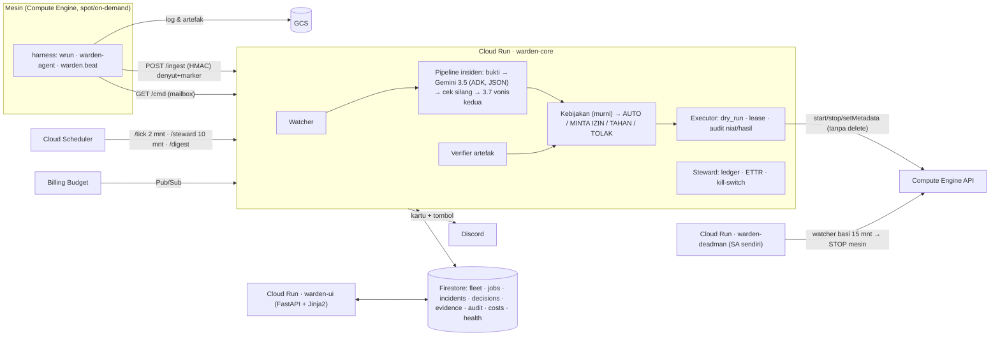
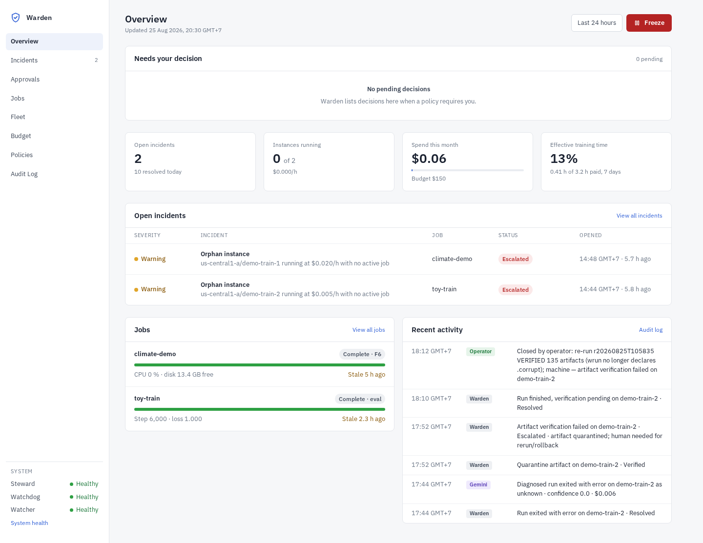
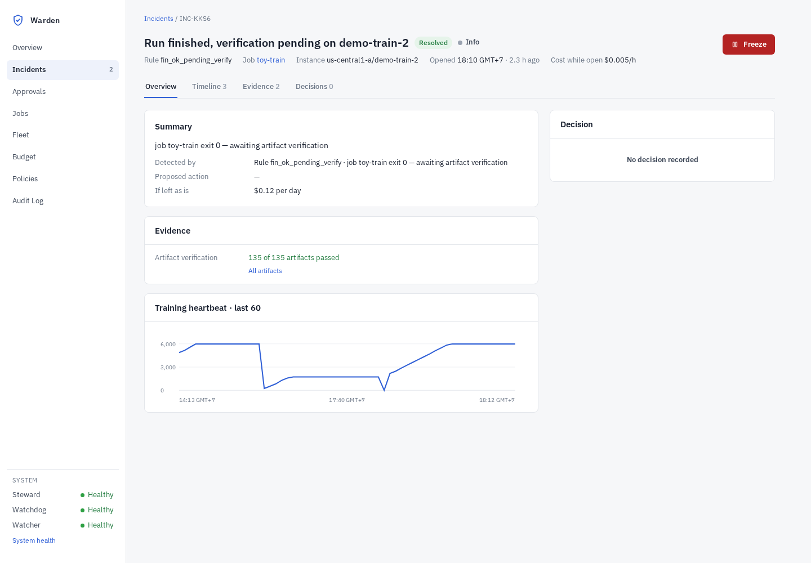
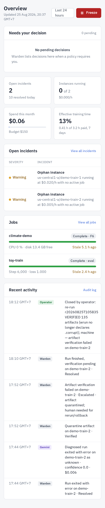

# Warden

**Warden menjaga pekerjaan komputasi panjang — training, evaluasi, pipeline — yang berjalan di mesin sewaan.**
Dua kalimat yang jadi tulang punggungnya:

- **Mesin hidup ≠ training benar.** Status `RUNNING` tidak berarti apa-apa. Yang penting: step bertambah, loss masuk akal, disk cukup, proses cuma satu — dan kalau berhenti, ada yang tahu dalam 5 menit.
- **Selesai ≠ utuh.** Marker `DONE`, exit code 0, berkas yang "ada" dengan ukuran benar — semuanya pernah berbohong. Yang dipercaya hanya artefak yang *dibuka*.

Warden lahir dari empat generasi "babysitter" yang kami tulis sendiri saat melatih model di cloud, dan dari 25 kegagalan yang benar-benar kami bayar (`docs/FAILURE-CATALOG.md`).

## Apa yang dilakukan Warden

| Kemampuan | Cara kerja |
|---|---|
| Deteksi deterministik | Watcher tiap 2 menit membaca status mesin, denyut harness, marker, dan artefak; aturan **dua-syarat** (sinyal diam + sinyal aktivitas) untuk macet/idle/yatim |
| Diagnosis semantik | Gemini 3.5 Flash (lewat ADK, skema JSON tetap) membaca log hanya bila teks tak bisa diregex aman; setiap klaim wajib menunjuk nomor baris; **cek silang deterministik** + vonis kedua (3.7 Flash) bila ragu |
| Verifikasi artefak | `torch.load`, parse CSV/JSONL/NPZ/Parquet, checksum sidecar, ukuran vs ekspektasi, "ukur hanya saat penulis diam"; `VERIFIED` hanya ditulis Warden |
| Tindakan berkebijakan | Otonomi bertahap per jenis tindakan (L0 amati → L1 minta izin → L2 lakukan lalu lapor → L3 diam), batas laju & biaya, circuit breaker, `dry_run`, blast radius, lease anti-balapan, **delete tidak pernah ada** |
| Penjaga anggaran | Ledger real-time, ETTR (waktu training efektif ÷ waktu mesin dibayar), yatim/idle → STOP, kill-switch Billing Budget 50/80/100 % |
| Pengawas luar | `warden-deadman` — layanan terpisah dengan identitas sendiri: kalau Warden berhenti berdenyut 15 menit, ia mematikan mesin |
| Manusia di HP | Kartu Discord dengan bukti + biaya + tombol Approve/Deny/Always; `/warden freeze` tombol merah global; foto layar dari HP dibaca Gemini |
| Dashboard | FastAPI + Jinja2 di atas satu stylesheet sistem desain (`warden/ui2/`): Overview *inbox-first* (keputusan yang butuh Anda di atas), Incident = narasi + rel keputusan (Detected → Diagnosed → Approval → Execute → Verify), Jobs, Fleet, Budget/ETTR, Policies, Audit Log, System Health. Waktu disimpan UTC dan dirender di zona browser. Paritas piksel terhadap mockup yang disetujui diukur otomatis (`chaos/ui2_pixel.py`, 0,40 %). |

Prinsip yang mengikat semua modul: **LLM tidak pernah memegang tombol**, **bukti = membuka**, **sukses harus berjejak**, **STOP bukan DELETE**, **flock bukan pgrep**, **ledger dulu mesin kemudian** (`plan.md` §1).

## Arsitektur



Layanan Google Cloud: Cloud Run (3 layanan), Firestore, Pub/Sub, Cloud Scheduler, Secret Manager, Compute Engine, Cloud Storage, Cloud Logging/Monitoring, Billing Budgets. Model: `gemini-3.5-flash` (diagnosis, multimodal), `gemini-3.5-flash-lite`, `gemini-3.7-flash` (vonis kedua) lewat Vertex AI (lokasi `global`) dengan identitas service account — tanpa kunci API di produksi. Framework agen: **Google ADK** (`LlmAgent` + `output_schema`).

## Menjalankan (≈30 menit)

Prasyarat: `gcloud` login pada akun dengan billing aktif, Python 3.12+, Java 21 (emulator lokal).

```bash
git clone <repo> warden && cd warden
python3.12 -m venv .venv && .venv/bin/pip install -r requirements-dev.txt   # runtime + pytest
make emulators && make test                # 41 tes unit + end-to-end di emulator
make smoke                                 # komponen ASLI: emulator + fake GCE + Gemini 3.5 nyata pada log nyata
```

Infrastruktur GCP (semua perintah ada di `infra/` dan `docs/JURNAL-KEPUTUSAN.md`):
1. Project baru + billing + API (`run cloudbuild artifactregistry firestore pubsub secretmanager compute cloudscheduler aiplatform logging monitoring billingbudgets storage`).
2. Firestore Native, topik `warden-events` + `billing-alerts`, bucket `<project>-warden`, Budget $150 (ambang 25/50/80/100 % → Pub/Sub).
3. Service account: `warden-core`, `warden-vm`, `warden-scheduler`, `warden-deadman` + role kustom `wardenInstanceOperator` (**tanpa** `compute.instances.delete`).
4. Secret Manager: `warden-ingest-hmac`, `warden-ui-secret`, (opsional) `discord-*`.
5. Deploy: `gcloud run deploy warden-core --source .` (Procfile), `warden-ui` (Procfile.ui, `--session-affinity --timeout 3600`), `warden-deadman` (Procfile.deadman, SA sendiri, tanpa akses publik).
6. Scheduler: `/tick` tiap 2 menit, `/steward` tiap 10 menit, `/digest` harian, deadman `/check` tiap 5 menit (OIDC).

Mesin yang dijaga:
```bash
python -m warden.cli job add climate-demo --instance us-central1-a/demo-train-1 --command run_pipeline.py --legacy \
  --expect-json '{"pred.csv": {"columns": ["ID","TargetF1","TargetRAUC"], "rows": 1030, "range01_columns": ["TargetRAUC"]}}'
WARDEN_CORE_URL=... WARDEN_HMAC=... WARDEN_RESUME_CMD='bash /opt/job_bootstrap.sh' bash infra/vm_create.sh demo-train-1 climate-demo e2-standard-2
```
Mesin yang **sudah ada**: `sudo WARDEN_JOB=<id> WARDEN_CORE_URL=... WARDEN_HMAC=... bash harness/install.sh`, lalu ganti satu baris peluncuran menjadi `wrun --job <id> -- <perintah asli>`. Kontrak lengkap: `harness/MARKER-SPEC.md`.

## Uji

- `make test` — 41 tes: kebijakan (matriks), mesin status, aturan Watcher, tick end-to-end, alur izin, verifier, Discord.
- `make smoke` — Gemini 3.5 asli mendiagnosis log NaN nyata: kategori `nan_input`, bukti baris 174–175, cek silang lolos, biaya ≈ $0,01.
- `python -m chaos.run` — 25 skenario kegagalan (fake GCE + emulator), 25/25 lulus.
- Uji hidup: `docs/DEMO.md` (preempt nyata via `simulate-maintenance-event`, artefak korup via mailbox `inject`, mesin yatim).

## Keamanan
Identitas per layanan; role kustom tanpa delete; IAM + kode sama-sama menolak mesin tanpa label `warden-managed=true`; HMAC untuk harness; Ed25519 untuk Discord; OIDC untuk Scheduler; rahasia hanya di Secret Manager; audit niat/hasil hanya-tambah; tombol merah `FREEZE`.

## Biaya
Free tier untuk Cloud Run/Firestore/Pub/Sub/Scheduler pada beban ini; Gemini ≈ $0,03 per insiden (batas $2/hari); mesin demo e2-standard-2 spot ≈ $0,02/jam. Rincian: `plan.md` §7.

## Dashboard (UI v2)
Sistem desain: `docs/mockup-v2/Components.dc.html` (satu skala status Healthy · Degraded · Stale · Failing · Frozen; satu skala insiden Open · Awaiting approval · Executing · Resolved · Escalated · Closed; tiga aktor Warden · Gemini · Operator; tata letak stat card / property list / table row). Setiap halaman hanya memakai komponen itu — tidak ada teks penjelas di layar.

| Overview | Incident | HP |
|---|---|---|
|  |  |  |

Verifikasi: `python -m chaos.ui2_pixel` (render templat vs artboard, jam dibekukan) dan render seluruh halaman terhadap Firestore prod (`docs/screenshots/ui2/`).

## Batasan & peta jalan
Belum: deteksi silent data corruption perangkat keras (butuh armada besar); promosi otonomi otomatis dari rekam jejak; IAP untuk dashboard. Rencana lengkap 15 fase: `plan.md`.

## Lisensi
MIT.
